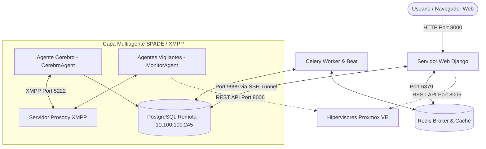

# 🚀 Guía de Inicio Rápido - SentinelNexus

Esta guía describe paso a paso el procedimiento completo para configurar y desplegar **SentinelNexus** desde la clonación inicial del repositorio hasta la puesta en marcha verificada de la plataforma y todos sus componentes.

---

## 🏗️ 1. Arquitectura y Componentes del Sistema

SentinelNexus es un sistema de monitoreo predictivo y autocuración para entornos Proxmox VE compuesto por los siguientes servicios:



---

## 📋 2. Prerrequisitos del Sistema

Antes de comenzar, asegúrate de contar con las siguientes herramientas instaladas en tu equipo:

- **Python**: Versión 3.10 o superior (`python --version`).
- **Git**: Para clonar y gestionar el repositorio (`git --version`).
- **Redis Server**: Servidor Redis ejecutándose localmente en el puerto `6379`.
  - *Windows*: Puedes usar Redis para Windows o ejecutarlo mediante Docker: `docker run -d -p 6379:6379 redis:alpine`
  - *Linux/macOS*: `sudo systemctl start redis` o `redis-server`
- **Cliente SSH**: Incluido de forma nativa en PowerShell (Windows) y Bash (Linux/macOS).
- **Acceso a la Red / VPN**:
  - Acceso SSH al servidor donde está alojada la BDD PostgreSQL (`10.100.100.245`).
  - Conectividad IP a la red de los hipervisores Proxmox (p. ej. `10.100.100.40`, `172.20.24.30`, etc.).

---

## 🛠️ 3. Pasos de Instalación y Configuración

### Paso 1: Clonar el Repositorio

Abre una terminal y clona el proyecto en tu máquina local:

```bash
git clone https://github.com/Cristianv222/SentinelNexus.git
cd SentinelNexus
```

---

### Paso 2: Crear y Activar el Entorno Virtual (`venv`)

Es fundamental aislar las dependencias del proyecto en un entorno virtual.

- **En Windows (PowerShell):**
  ```powershell
  python -m venv venv
  .\venv\Scripts\activate
  ```

- **En Linux / macOS (Bash):**
  ```bash
  python3 -m venv venv
  source venv/bin/activate
  ```

> [!TIP]
> Si en PowerShell recibes un error sobre ejecución de scripts desactivada, ejecuta temporalmente: `Set-ExecutionPolicy -Scope Process -ExecutionPolicy Bypass` y vuelve a activar el entorno virtual.

---

### Paso 3: Instalar Dependencias de Python

Con el entorno virtual activado, actualiza `pip` e instala las dependencias declaradas en `requirements.txt`:

```bash
python -m pip install --upgrade pip
pip install -r requirements.txt
```

---

### Paso 4: Configurar Variables de Entorno (`.env`)

Crea un archivo llamado `.env` en la raíz del proyecto (junto a `manage.py`). Puedes basarte en el siguiente esquema preconfigurado:

```ini
# Configuración de Django
SECRET_KEY=clave_secreta_super_segura_de_desarrollo
DEBUG=True

# Base de Datos PostgreSQL Remota (Conectada a través del Túnel SSH)
DB_NAME=sentinel_nexus
DB_USER=serntinelnexus
DB_PASSWORD=sn.monitor
DB_HOST=localhost
DB_PORT=9999

# Configuración de Redis & Celery Broker
REDIS_HOST=localhost
REDIS_PORT=6379
CELERY_BROKER_URL=redis://localhost:6379/0
REDIS_URL=redis://localhost:6379/1

# Configuración de Servidores Proxmox VE
PROXMOX_NODE1_HOST=10.100.100.40
PROXMOX_NODE1_USER=root@pam
PROXMOX_NODE1_PASSWORD=TuPasswordAqui
PROXMOX_NODE1_VERIFY_SSL=false
PROXMOX_NODE1_NAME=Servidor Principal
PROXMOX_NODE1_PORT=8006

# Configuración XMPP (Servidor Prosody para Agentes)
XMPP_DOMAIN=sentinelnexus.local
XMPP_HOST=10.100.100.41
XMPP_PASSWORD=sentinel123

# Configuración de Grafana
GRAFANA_URL=http://10.100.100.201:3000
GRAFANA_DASHBOARD_ID=proxmox-monitoring
```

> [!IMPORTANT]
> Reemplaza las credenciales del archivo `.env` por las correspondientes a tu infraestructura de pruebas o producción.

---

### Paso 5: Abrir el Túnel SSH a la Base de Datos Remota

Dado que la Base de Datos PostgreSQL reside en un servidor remoto (`10.100.100.245`) y Django busca conectarse a `localhost:9999`, **debes establecer un Túnel SSH**.

Abre una **NUEVA TERMINAL (Terminal 1)** y ejecuta:

```powershell
# En Windows (PowerShell) o Linux/macOS:
ssh -L 9999:localhost:5432 usuario@10.100.100.245
```
*(Reemplaza `usuario` por tu usuario SSH en dicho servidor)*.

> [!CAUTION]
> **DÉJALO CORRIENDO**: No cierres ni interrumpas esta terminal durante todo el tiempo que estés trabajando con la aplicación.

---

### Paso 6: Migrar e Inicializar la Base de Datos

En tu **Terminal 2** (con el entorno virtual activado y el túnel SSH abierto):

1. **Aplicar las migraciones de Django**:
   ```powershell
   python manage.py migrate
   ```

2. **Crear un Superusuario para acceder al Panel de Administración (Opcional)**:
   ```powershell
   python manage.py createsuperuser
   ```

3. **Sincronizar el inventario inicial de Proxmox**:
   ```powershell
   python manage.py sync_proxmox
   ```

---

## ⚡ 4. Ejecución del Sistema completo (Multiproceso)

Para poner en marcha el sistema completo con todas sus capacidades (Dashboard Web, Tareas periódicas de Celery y Sistema Multiagente), abre terminales independientes según sea necesario:

### 🌐 Terminal 2: Servidor Web Django (OBLIGATORIO)

Ejecuta el servidor web de desarrollo:

```powershell
python manage.py runserver
```

Abre tu navegador e ingresa a: **`http://127.0.0.1:8000/`** (o `http://127.0.0.1:8000/admin/`).

---

### 🔄 Terminal 3: Celery Worker & Beat (OPCIONAL - Tareas Periódicas)

Asegúrate de que **Redis** esté ejecutándose en el puerto `6379`.

1. **Iniciar Celery Worker**:
   - *Windows (PowerShell)*:
     ```powershell
     celery -A sentinelnexus worker --loglevel=info -P solo
     ```
   - *Linux / macOS*:
     ```bash
     celery -A sentinelnexus worker --loglevel=info
     ```

2. **Iniciar Celery Beat (Programador de tareas)** en otra terminal:
   ```powershell
   celery -A sentinelnexus beat --loglevel=info
   ```

---

### 🤖 Terminal 4 & 5: Sistema Multiagente SPADE / XMPP (OPCIONAL - Monitoreo Autónomo & Autocuración)

Si tu entorno requiere la recolección autónoma distribuida y el autocurado (Watchdog) mediante agentes SPADE:

1. **Registro inicial de cuentas XMPP (Solo la primera vez)**:
   ```powershell
   python register_xmpp_accounts.py
   ```

2. **Iniciar Agente Cerebro (Coordinador y Watchdog)** (Terminal 4):
   ```powershell
   python run_cerebro_agent.py
   ```

3. **Iniciar Agentes Vigilantes (Recolectores Proxmox)** (Terminal 5):
   ```powershell
   python run_vigilante_agent.py
   ```

---

## 🔍 5. Diagnóstico de Problemas Comunes

| Síntoma / Error | Causa Probable | Solución Recomendada |
| :--- | :--- | :--- |
| `psycopg2.OperationalError: could not connect to server` | El túnel SSH a la Base de Datos está cerrado o falló. | Verifica que la **Terminal 1** siga ejecutando `ssh -L 9999:localhost:5432 ...` y que puedas hacer login SSH. |
| `redis.exceptions.ConnectionError: Error 61 / 10061` | Servidor Redis no está en ejecución. | Inicia Redis mediante `docker run -d -p 6379:6379 redis:alpine` o inicia el servicio local de Redis. |
| `Proxmox Server Offline / Connection Timeout` | Sin conectividad IP con los hipervisores. | Verifica la VPN o la red local haciendo ping: `ping 172.20.24.30` o `ping 10.100.100.40`. |
| `Error in site-packages/aioxmpp or SPADE TLS handshake` | Prosody requiere SSL/TLS no configurado localmente. | Los scripts `run_cerebro_agent.py` y `run_vigilante_agent.py` incluyen un parche automático para relajar la seguridad TLS en desarrollo. Asegúrate de ejecutar los agentes mediante estos runners en lugar de invocarlos directamente. |
| `ModuleNotFoundError: No module named 'submodulos'` | El entorno virtual no está activado o la terminal está en el directorio equivocado. | Ejecuta `.\venv\Scripts\activate` y asegúrate de estar en la raíz del proyecto `SentinelNexus`. |

---

## 📌 Resumen Rápido de Comandos (Cheat Sheet)

```bash
# 1. Clonar e ingresar
git clone https://github.com/Cristianv222/SentinelNexus.git
cd SentinelNexus

# 2. Entorno e instalación
python -m venv venv
.\venv\Scripts\activate
pip install -r requirements.txt

# 3. Túnel SSH BDD (Terminal 1)
ssh -L 9999:localhost:5432 usuario@10.100.100.245

# 4. Migración (Terminal 2)
python manage.py migrate

# 5. Iniciar Servidor (Terminal 2)
python manage.py runserver
```
