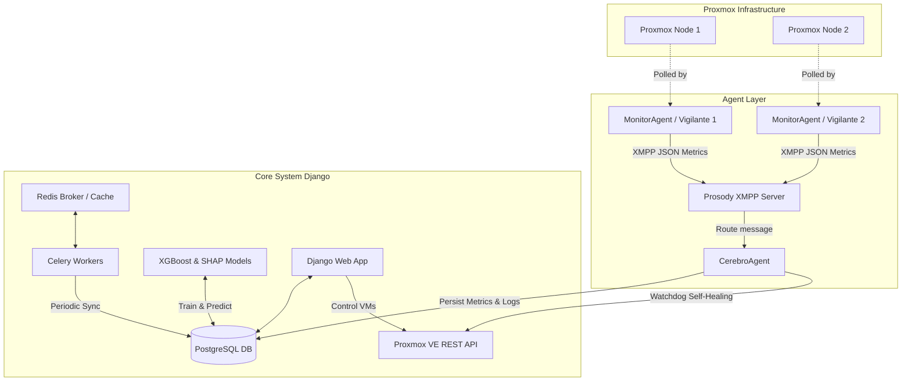

# Análisis Completo del Proyecto: SentinelNexus

**SentinelNexus** es una plataforma avanzada de monitoreo en tiempo real, detección inteligente de anomalías, planificación predictiva de capacidad y auto-recuperación (self-healing) para hipervisores **Proxmox VE** y sus entornos virtualizados (Máquinas Virtuales y Contenedores LXC). 

A continuación, se detalla un desglose completo de la arquitectura del proyecto, las herramientas y tecnologías utilizadas, los modelos de datos y los flujos operativos clave.

---

## 1. Stack Tecnológico y Herramientas Utilizadas

El sistema integra múltiples capas tecnológicas para la recopilación de datos, mensajería en tiempo real, persistencia, aprendizaje automático e interfaces de usuario.

| Categoría | Tecnología / Librería | Propósito en el Proyecto |
| :--- | :--- | :--- |
| **Framework Web** | **Django (Python)** | Servidor de aplicaciones principal, enrutamiento, lógica de negocio y plantillas del dashboard interactivo. |
| **Interfaz Admin** | **Jazzmin (Tema Darkly)** | Interfaz de administración de Django personalizada con un tema oscuro estilizado y constructores de UI dinámicos. |
| **Base de Datos** | **PostgreSQL** | Motor de base de datos relacional para persistir la topología de la infraestructura, métricas históricas, predicciones, logs de agentes y logs de explicabilidad XAI. |
| **Cola de Tareas** | **Celery** | Motor de ejecución de tareas en segundo plano (p. ej., sincronización periódica de inventario, recolección híbrida de métricas locales/remotas). |
| **Programador** | **django-celery-beat** | Programación periódica y calendarización de las tareas de Celery. |
| **Broker / Cache** | **Redis** | Broker de mensajería para Celery y almacén de caché en memoria de alto rendimiento para sesiones. |
| **Sistema Multiagente** | **SPADE Framework** | Marco de desarrollo para el agente de almacenamiento/coordinación (`CerebroAgent`) y los agentes colectores (`MonitorAgent`). |
| **Protocolo de Red** | **XMPP / Slixmpp & Aioxmpp** | Protocolo estándar de mensajería instantánea federado utilizado para la comunicación asíncrona y paso de mensajes JSON entre agentes. |
| **Servidor XMPP** | **Prosody IM** | Servidor XMPP liviano encargado de autenticar y enrutar los mensajes entre los agentes. |
| **API Proxmox** | **Proxmoxer** | Cliente Python para interactuar de forma programática con la API REST de Proxmox VE (obtener estado de nodos, apagar/encender VMs, obtener configuraciones de hardware). |
| **Machine Learning** | **XGBoost (xgboost)** | Regresor de gradiente aumentado para entrenar modelos predictivos sobre el consumo futuro de CPU y RAM de servidores y VMs. |
| **Inteligencia Explicable** | **SHAP (shap)** | Generación de valores Shapley para identificar y explicar matemáticamente qué variables (lags horarias, estacionalidades) influyen en las predicciones. |
| **Procesamiento de Datos** | **Pandas, NumPy, Scikit-Learn** | Limpieza, estructuración, remuestreo horario de series temporales y cálculo de métricas de error (residuales). |
| **Métricas Locales** | **psutil** | Librería utilizada para capturar recursos del servidor local donde corre Django (CPU, memoria, disco). |
| **Visualización** | **Grafana** | Visualización interactiva de paneles de monitoreo integrados en las vistas de Django. |

---

## 2. Arquitectura Lógica y Componentes

El proyecto SentinelNexus se divide en tres componentes arquitectónicos principales:



### A. Capa de Monitoreo Multiagente (SPADE)
Consiste en procesos autónomos distribuidos que se comunican a través de XMPP:
*   **MonitorAgent (Vigilante)**: ([monitor.py](file:///c:/Users/user/Documents/GitHub/SentinelNexus/submodulos/agents/monitor.py))
    Se ejecuta de forma continua en cada servidor. Cada 3 minutos (180 segundos), se conecta a la API de Proxmox del nodo asignado, recupera el estado de salud del nodo físico (CPU, RAM, Uptime) y de todas sus VMs y Contenedores LXC en ejecución. Luego, empaqueta esta información en un objeto JSON y la transmite a la dirección XMPP del agente Cerebro (`cerebro@sentinelnexus.local`).
*   **CerebroAgent**: ([cerebro.py](file:///c:/Users/user/Documents/GitHub/SentinelNexus/submodulos/agents/cerebro.py))
    Es el nodo central de datos y control. Tiene tres comportamientos integrados:
    1.  **Escucha de Mensajes (`ComportamientoEscucha`)**: Recibe continuamente los reportes JSON XMPP de los Vigilantes, extrae la telemetría y guarda las métricas de nodos y VMs en la base de datos PostgreSQL.
    2.  **Planificador de Capacidad (`ComportamientoPrediccion`)**: Cada hora, desencadena de forma asíncrona el entrenamiento de los modelos XGBoost para proyectar las próximas 48 horas de carga.
    3.  **Watchdog Autocurativo (`ComportamientoWatchdog`)**: Cada 30 segundos, comprueba el estado de las VMs críticas marcadas con `is_critical=True`. Si detecta que una VM crítica se encuentra en estado `stopped` (apagada de forma imprevista), envía un comando a la API de Proxmox para forzar su encendido automático e introduce un registro de alerta (`ACTION`) en el historial de logs de la base de datos.

### B. Módulo Predictivo y Explicabilidad (XAI)
El archivo ([forecasting.py](file:///c:/Users/user/Documents/GitHub/SentinelNexus/submodulos/logic/forecasting.py)) encapsula el motor de Machine Learning:
*   **Preparación de Series Temporales (`prepare_features`)**: A partir de los datos históricos de consumo de CPU/RAM remuestreados a promedios horarios, genera características avanzadas:
    *   *Lag features*: Valores registrados hace 1 hora (`lag_1`), 2 horas (`lag_2`) y 24 horas (`lag_24`).
    *   *Rolling features*: Promedios móviles de las últimas 3 (`rolling_mean_3`) y 6 horas (`rolling_mean_6`).
    *   *Estacionalidad temporal*: La hora del día (`hour`) y el día de la semana (`dayofweek`).
*   **Modelo de Regresión**: Entrena modelos `xgb.XGBRegressor` por separado para predecir CPU y memoria RAM. 
*   **Predicción Recursiva (`recursive_forecast`)**: Proyecta las métricas futuras de forma iterativa hora por hora. Calcula intervalos de confianza basados en la desviación estándar de los residuales de entrenamiento.
*   **Explicabilidad Local con SHAP**: Aplica `shap.TreeExplainer` sobre el modelo XGBoost para el pico de CPU estimado en el horizonte futuro. Determina el impacto positivo o negativo de cada característica en el resultado y traduce estos valores matemáticos a una narrativa estructurada en español que se almacena en la tabla `XAIExplanationLog` con diagnósticos precisos y recomendaciones operativas automáticas.

### C. Aplicación Web Django
Expone la interfaz de usuario web y endpoints API:
*   **Dashboard de Nodos (`nodes_overview`)**: Vista consolidada en tiempo real de la capacidad total del cluster y estado de los servidores Proxmox.
*   **Detalle de Nodos (`node_detail_new`)**: Gráficos de series temporales de rendimiento de hardware físico y lista completa de VMs/contenedores alojados.
*   **Detalle de VMs (`vm_detail_new`)**: Ficha técnica de la máquina, estado del Watchdog, predicción de carga a 48 horas con gráficos de área para intervalos de confianza, y el panel de explicabilidad XAI detallando las causas raíz y diagnósticos recomendados.
*   **Live Agent Console (`agent_dashboard`)**: Consola en tiempo real para visualizar los logs internos de las actividades, decisiones y alertas tomadas por Cerebro y los Vigilantes.
*   **Exportación de Datos (`data_dashboard`)**: Filtros temporales y exportación del historial completo a formatos CSV para auditoría.

---

## 3. Modelo de Base de Datos (Esquema PostgreSQL)

El archivo ([models.py](file:///c:/Users/user/Documents/GitHub/SentinelNexus/submodulos/models.py)) define las tablas del sistema:

*   **`ProxmoxServer`**: Registra los hipervisores físicos configurados, sus credenciales, especificaciones técnicas (cores de CPU, modelo, RAM total, almacenamiento total) y estado activo.
*   **`Nodo`**: Nodos que pertenecen al cluster Proxmox, enlazados a `ProxmoxServer`.
*   **`MaquinaVirtual`**: Inventario de VMs y contenedores LXC. Contiene los campos booleanos:
    *   `is_monitored`: Si debe ser rastreada para telemetría histórica.
    *   `is_critical`: Si está sujeta al Watchdog de auto-recuperación en caso de fallo.
*   **`RecursoFisico`**: Capacidad total y disponible de los recursos de hardware del nodo (CPU, RAM, Almacenamiento).
*   **`AsignacionRecursosInicial`**: Recursos asignados por Proxmox a cada VM (cores asignados, memoria MB, espacio asignado).
*   **`ServerMetric`**: Serie temporal del estado físico del hipervisor (CPU %, RAM %, Disco %, Uptime).
*   **`VMMetric`**: Serie temporal del estado de rendimiento de las máquinas virtuales.
*   **`ServerPrediction` / `VMPrediction`**: Almacena las proyecciones de CPU y RAM, intervalos de confianza superior/inferior, y banderas que marcan si la fecha futura representa un consumo anómalo.
*   **`XAIExplanationLog`**: Registra las narrativas generadas por SHAP:
    *   `diagnostico_evento`: Ej. "Pico Crítico Anómalo Previsto".
    *   `explicacion_texto`: Narrativa contextualizada en español.
    *   `accion_recomendada`: Recomendaciones para mitigar el consumo previsto.
    *   `valores_shap`: JSON con los valores SHAP calculados.
    *   `features_usadas`: JSON con los datos de entrada al modelo.
*   **`AgentLog`**: Registro histórico de eventos operacionales de los agentes (niveles: `INFO`, `WARNING`, `ACTION`, `CRITICAL`).

---

## 4. Guía de Ejecución del Proyecto

Para arrancar el ecosistema completo en modo de desarrollo local, se deben seguir los siguientes pasos secuenciales:

### Paso 1: Establecer el Túnel SSH
La base de datos PostgreSQL se encuentra alojada de forma remota en la dirección IP `10.100.100.245`. Para que Django se conecte, se debe habilitar un reenvío de puertos local en la terminal principal de desarrollo:
```powershell
ssh -L 9999:localhost:5432 usuario@10.100.100.245
```
*(Esto expone la base de datos remota en `localhost:9999` dentro de tu máquina).*

### Paso 2: Activar Entorno Virtual e Iniciar Django
En una segunda terminal, activa el entorno virtual de Python e inicia el servidor web de desarrollo:
```powershell
.\venv\Scripts\activate
python manage.py runserver
```

### Paso 3: Levantar el Agente Cerebro
Cerebro procesará los reportes XMPP entrantes de los Vigilantes y ejecutará los modelos XGBoost predictivos. Abre una nueva terminal e inicia su ejecución:
```powershell
.\venv\Scripts\activate
python run_cerebro_agent.py
```

### Paso 4: Levantar los Agentes Vigilantes
Los agentes Vigilantes consultan periódicamente la API de Proxmox y reportan a Cerebro. Inícialos en una terminal adicional:
```powershell
.\venv\Scripts\activate
python run_vigilante_agent.py
```

*(Opcional: Si el planificador periódico de Celery está activo, los workers y Celery Beat pueden iniciarse para sincronizar la infraestructura usando Redis local).*
